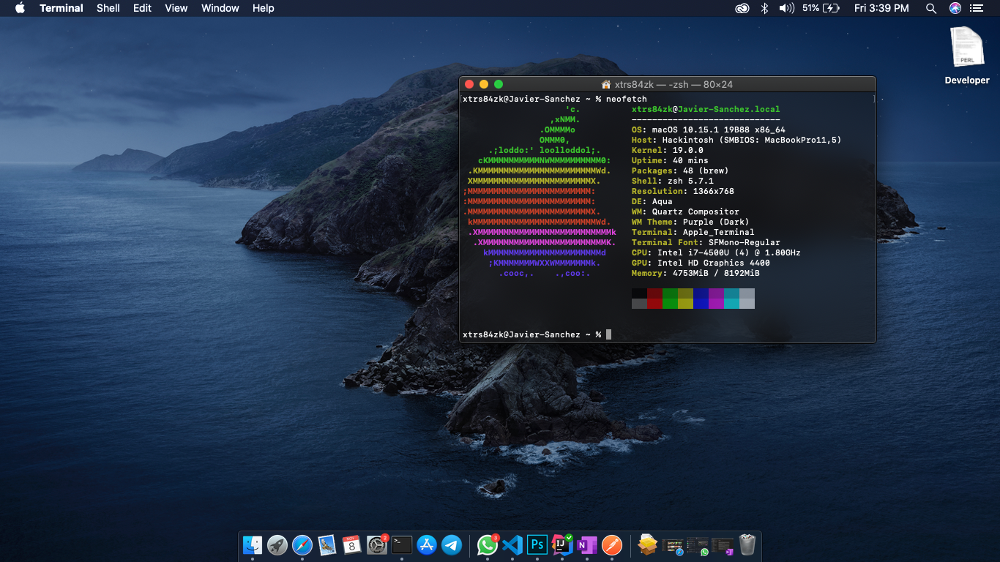

# Aspire V5-573P Hackintosh
EFI and resources for doing hackintosh on the Acer Aspire V5-573P-74508G1.

Tested on:

- Mojave 14.0 -> 14.6
- Catalina 15.0 -> 15.6
-  11 boots existing installs (Fixing install on [the OpenCore branch](https://github.com/xtrs84zk/Aspire-V5-573P-Hackintosh/tree/OpenCore) , though) just tried beta1 (20A4299v).


## Instructions
1. Copy the EFI folder on your installer's USB to boot. <br/>
2. Install macOS. (I'm using APFS file system on my SSD) <br/>
3. If something fails, refer to [RehabMan's guide](https://www.tonymacx86.com/threads/guide-booting-the-os-x-installer-on-laptops-with-clover.148093/) for laptops. <br/>
4. Feel free to reach out if you need any help or found how to fix something. [Telegram](https://t.me/xtrs84zk) | [Twitter](https://twitter.com/xtrs84zk) 

## Post Installation
- If using the same Intel Wireless card, install [Heliport](https://github.com/OpenIntelWireless/HeliPort/releases) to the Applications folder and add it to the login items.


- Move any custom kext to /EFI/Clover/kexts/Others.


- For keyboard layout (the latin american one) - Using A layout. <br/>
  Thanks to neosergio for [this](https://github.com/neosergio/Latam-Keyboard). 

```bash
git clone https://github.com/neosergio/Latam-Keyboard.git && cd Latam-Keyboard && cp -v Latam*.* ~/Library/Keyboard\ Layouts/
```

- Download [Clover Configurator](https://mackie100projects.altervista.org/download-clover-configurator/) and configure your serial number, uuid, and other identifiers. ([Propertree](https://github.com/corpnewt/ProperTree) can be used too). The ones on the plist are a scramble of the ones I'm using. As for how to configure it, the correct way is described here: [An iDiot's Guide To iMessage](https://www.tonymacx86.com/threads/an-idiots-guide-to-imessage.196827/) .


## Some fixes

Error 500 on AppStore:

Log out of the AppStore and run this command in terminal.

```bash
defaults write com.apple.appstore.commerce Storefront -string \
    "$(defaults read com.apple.appstore.commerce Storefront | sed s/,8/,13/)"
```

## What's working
* USB ports <br/>
* Integrated Graphics <br/>
* Battery indicator <br/>
* Trackpad (with gestures) <br/>
* Keyboard backligth <br/>Fn5, Fn6, Fn7, Fn9, Fn8 as expected. <br/>
* Some Fn keys migth have diferent behavior.
* Audio with VoodooHDA. 
* Brightness. Use "pausa" to up the level and Fn+F12 to lower it. (Working on setting the rigth keycombo)
* Touchscreen, same gestures as trackpad. <br/>
* Siri, Nice. <br/>
* Microphone. <br/>
* Wifi  / Bluetooth

## What's sometimes working
* Sleep. It's rare when it doesn't. <br/>

## What's not working
* I don't know why cursor doesn't show up, it can be moved, clicked and so on, it's just invisible.
* Power off. (Restart to clover and press the power button) <br/>
* HDMI video output.
* HDMI audio output.

## Hardware changes

- Wireless card replaced with an Intel AC 3165
- Internal HDD replaced with an SSD

## Contributing

New fixes are always welcome. Just issue or send a pull request. Don't forget to scramble the serial number and so before the push. 

## Special thanks
* [USB Map](https://github.com/corpnewt/USBMap) - corpnewt's tool <br/>
* [Fewtarius's](https://fewtarius.gitbook.io/laptopguide/) - For the vanilla laptop guide. <br/>
* [VoodooHDA](https://github.com/chris1111/VoodooHDA-2.9.2-Clover-V14) - Yeah, we hate it, we love it. <br/>
* [Hackintool](https://www.tonymacx86.com/threads/release-hackintool-v2-8-6.254559/) - For making it easier on newer releases. <br/>
* [trs96](https://www.tonymacx86.com/threads/appstore-the-operation-couldnt-be-completed-com-apple-commerce-client-error-500.270957/post-1912788) -  For the solution to error 500 on AppStore. <br/>
* [Acidanthera](https://github.com/acidanthera/VoodooPS2) - For the macOS like trackpad experience.