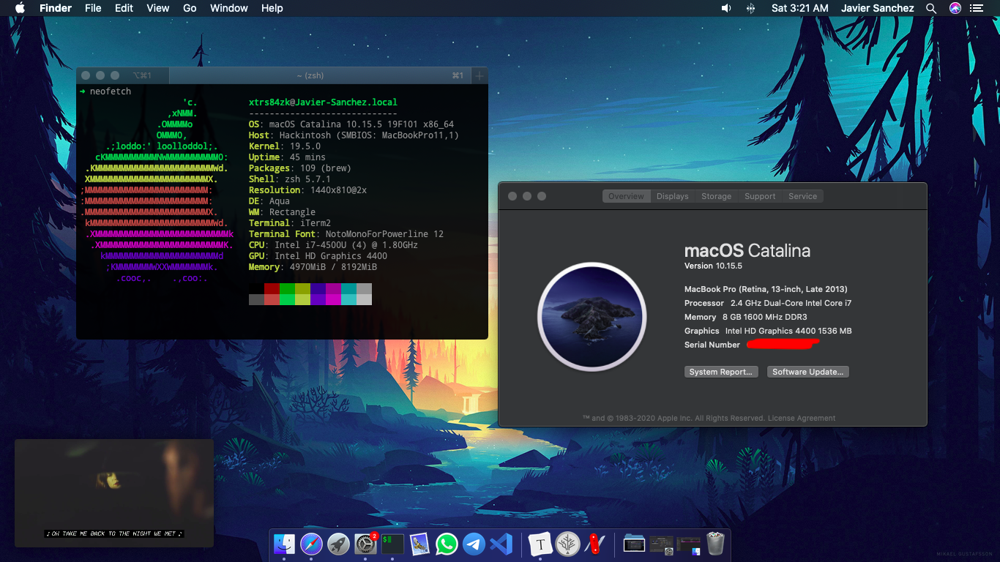
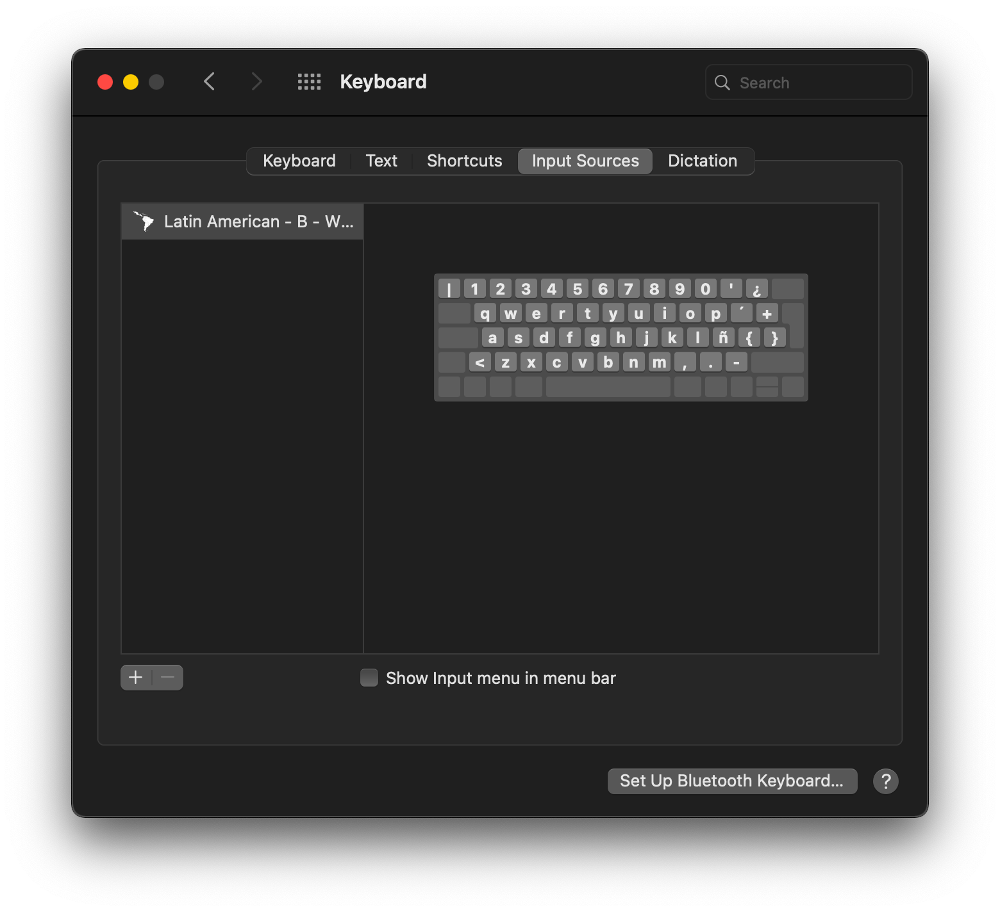
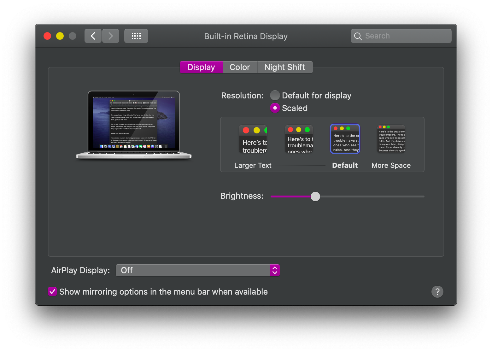
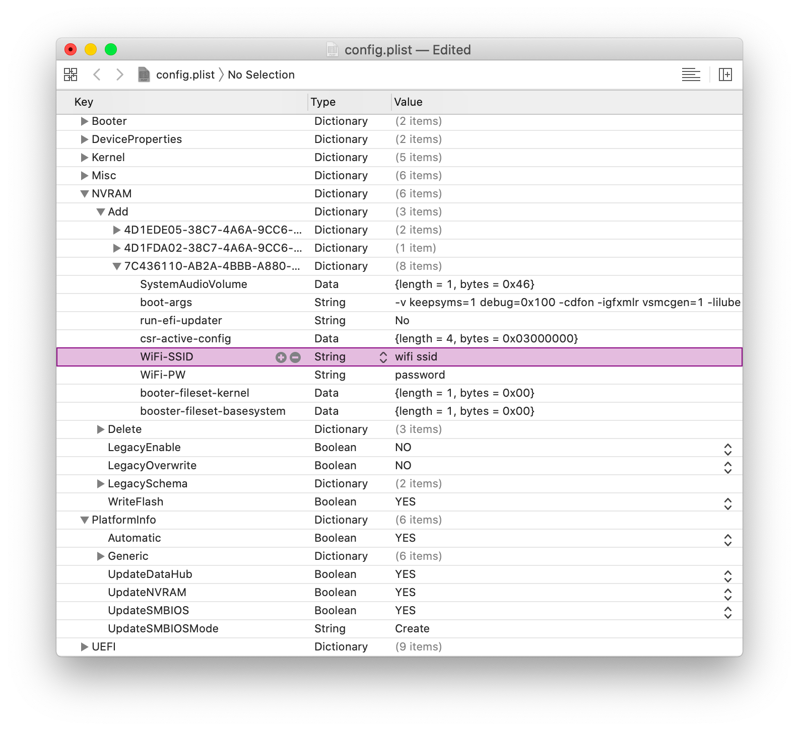

# Aspire V5-573P Hackintosh
## OpenCore branch (WIP)

EFI and resources for doing hackintosh on the Acer Aspire V5-573P-74508G1. This branch is based on the work by Dortania on the [OpenCore Laptop Vanilla Guide](https://dortania.github.io/vanilla-laptop-guide/)



## Status

- It boots!.

- Using OpenCore 6.0 @[fd33d8e](https://github.com/acidanthera/OpenCorePkg/commit/fd33d8e2419ebbf7651780655bc6329cb5383f2f) (Compiled by me, still in beta as the day of this commit)

  

- Doesn't boot Big Sur, specially not the installer. Working on it.

## Instructions

1. Copy the EFI folder on your installer USB to boot. (Must have a GUID partition table, copy the folder to the 200mb FAT32 one) <br/>
2. Install macOS. <br/>
3. Use [MountEFI](https://github.com/corpnewt/MountEFI) to mount the ESP on the internal disk of your system and copy the EFI contents to it.<br/>
4. Feel free to reach out if you need any help or found how to fix something. [Telegram](https://t.me/xtrs84zk) | [Twitter](https://twitter.com/xtrs84zk) 

## Post Installation
1. For keyboard layout (the latin american one) - Using B layout. 

```bash
git clone https://github.com/neosergio/Latam-Keyboard.git && cd Latam-Keyboard && cp -v Latam*.* ~/Library/Keyboard\ Layouts/
```

Then set it on System Preferences.



1. Use xzhih's [script](https://github.com/xzhih/one-key-hidpi) to enable hidpi. (Recommended)

   

3. Configure your serial number, uuid, and other identifiers. The ones on the plist are a scramble of the ones I'm using. As for how to configure it, the correct way is described in [this section](https://dortania.github.io/OpenCore-Desktop-Guide/post-install/iservices) of the guide.

3. Reboot a couple of times to let it sit.

   1. Hardcode your wifi SSID in the config.plist -> NVRAM -> Add -> 7C436110-AB2A-4BBB-A880-FE41995C9F82 -> WiFi-SSID && WiFi-PW and it will autoconnect. Alternatively, try the  [Heliport](https://github.com/zxystd/HeliPort) app with the [itlwm](https://github.com/OpenIntelWireless/itlwm) kext.

   

## Some fixes

Error 500 on AppStore:

Log out of the AppStore and run this command in terminal.

```bash
defaults write com.apple.appstore.commerce Storefront -string \
    "$(defaults read com.apple.appstore.commerce Storefront | sed s/,8/,13/)"
```

## What's working
* USB ports <br/>
* Integrated Graphics <br/>
* Trackpad (With gestures) <br/>
* Wifi (The Intel card I got, credentials on nvram) <br/>
* Bluetooth.
* Touchscreen (With the same gestures as the trackpad, even on Catalina!) <br/>
* Keyboard backligth. Fn5, Fn6, Fn7, Fn9, Fn8 as expected. <br/>
* Brightness control. <br/>
* Audio with VoodooHDA. <br/>
* HDMI video output. <br/>
* Siri.

## What's sometimes working
* Some Fn keys migth have diferent behavior. (Fn + F12 lowers brightness and 'Pausa' increments it)
* HDMI audio output. (VoodooHDA thing, maybe (?))
* Microphone gain needs to be adjusted (lowered) using the VoodooPrefpanel. (Download from [here](https://sourceforge.net/projects/voodoohda/files/VoodooHDA.prefPane.zip/download?use_mirror=cfhcable&download=&failedmirror=jaist.dl.sourceforge.net) and copy to /Library/PreferencePanes/ then look for it on System Preferences)

## What's not working
* Power off. (Restart to clover and press the power button) <br/>

* Sleep (OpenCore's sleep is way harder.) <br/>

* Battery indicator. (OpenCore's battery is **way** harder.) <br/>

  

## Contributing

New fixes are always welcome. Just issue or send a pull request. Don't forget to scramble the serial number and so before the push. 

## Special thanks
* [Acidanthera](https://github.com/acidanthera/VoodooPS2) - For the macOS like trackpad experience, OpenCore and most of the kexts used.
* [USB Map](https://github.com/corpnewt/USBMap) - corpnewt's tool <br/>
* [Fewtarius's](https://fewtarius.gitbook.io/laptopguide/) - For the vanilla laptop guide. <br/>
* [VoodooHDA](https://github.com/chris1111/VoodooHDA-2.9.2-Clover-V14) - Yeah, we hate it, we love it. <br/>
* [xzhih](https://github.com/xzhih) - For the method to enable HiDPI. <br/>
* [Hackintool](https://www.tonymacx86.com/threads/release-hackintool-v2-8-6.254559/) - For making it easier on newer releases. <br/>
* [trs96](https://www.tonymacx86.com/threads/appstore-the-operation-couldnt-be-completed-com-apple-commerce-client-error-500.270957/post-1912788) -  For the solution to error 500 on AppStore. <br/>
* [neosergio](https://github.com/neosergio) - For the keyboard layout.